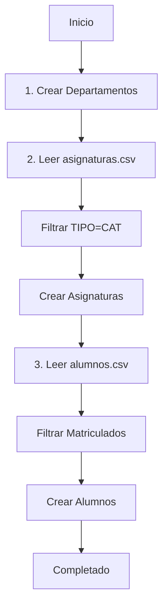

#  Carga Masiva de Datos - Guía de Uso

##  Resumen

**Recomendación:** Script de Seeding (ya implementado) 

### ¿Por qué Script de Seeding es mejor que un endpoint?

| Aspecto | Script Seeding | Endpoint CSV |
|---------|----------------|--------------|
| Seguridad |  No expuesto en producción |  Podría ser abusado |
| Validaciones |  Usa servicios existentes |  Requiere implementación adicional |
| Debugging |  Fácil de ejecutar localmente |  Difícil de debuggear |
| Dependencias |  Maneja orden automáticamente |  Requiere lógica compleja |
| Reutilización |  Perfecto para seeding inicial |  Solo útil para cargas |
| Performance |  Puede optimizarse fácilmente |  Limitado por HTTP timeout |

##  Uso del Script

### 1 Preparar los CSV

Coloca tus archivos en `backend/data/`:

```bash
backend/
  data/
    alumnos.csv      # Datos de estudiantes
    asignaturas.csv  # Datos de cursos
    README.md        # Documentación
```

#### Formato Alumnos (alumnos.csv)
**Delimitador:** `;` (punto y coma)

```csv
"RUT";"PRIMER_NOMBRE";"SEGUNDO_NOMBRE";"APELLIDOPATERNO";"APELLIDOMATERNO";"CORREO_ALUMNO";"ADMISION";"CODCARRERA";"NOMBRECARRERA";"PROMEDIO";"NIVEL";"ESTADO_ACTUAL";"PERIODO"
214605538;BENJAMIN;ANDRES;VILLAFAÑA;POBLETE;benjamin.villafana@alumnos.ucn.cl;202410;8486;MEDICINA;5.89;3;Matriculado;202520
```

#### Formato Asignaturas (asignaturas.csv)
**Delimitador:** `,` (coma)

```csv
PERIODO,DEPARTAMENTO,CURSO,NOMBRE,PARALELO,NRC,TIPO,RUT_PROFESOR,PRIMER_NOMBRE,SEGUNDO_NOMBRE,APELLIDOPATERNO,APELLIDOMATERNO,CORREO_INSTITUCIONAL
202520,Depto. De Ciencias Biomédicas,DCBI-00402,Biomecánica,C1,20727,CAT,175123334,FERNANDO,SAAD,MARGARIÑOS,SELAIVE,fernando.magarinos@ucn.cl
```

### 2 Ejecutar el Seeding

```bash
cd backend
npm run seed
```

### 3 Salida Esperada

```
 Iniciando proceso de seeding...

 Paso 1: Cargando Departamentos...
  Departamento creado: Depto. De Ciencias Biomédicas
   Departamento creado: Depto. De Clínicas
  ⏭  Departamento ya existe: Medicina

 Paso 2: Cargando Asignaturas desde CSV...
   Total de registros en CSV: 150
   Asignaturas únicas a crear: 75
   10 asignaturas creadas...
   20 asignaturas creadas...
  
   Resumen Asignaturas:
      Creadas: 72
     ⏭  Ya existían: 3
      Errores: 0

 Paso 3: Cargando Alumnos desde CSV...
   Total de alumnos en CSV: 100

 20 alumnos creados...
   40 alumnos creados...
  
   Resumen Alumnos:
      Creados: 87
       Ya existían: 8
     Errores: 5

 Proceso de seeding completado exitosamente!
```

##  Estructura del Sistema

```
backend/
├── src/
│   └── seed.ts              #  Script principal
├── data/
│   ├── README.md            # Documentación CSV
│   ├── alumnos.csv          # Datos alumnos
│   └── asignaturas.csv      # Datos asignaturas
└── package.json             # Script: "seed"
```

##  Proceso Interno



##  Validaciones Automáticas

### Alumnos:
- ✓ Solo `ESTADO_ACTUAL = "Matriculado"`
- ✓ RUT y correo obligatorios
- ✓ Formato RUT: `12345678-9`
- ✓ Evita duplicados por RUT

### Asignaturas:
- ✓ Solo `TIPO = "CAT"` (cátedras)
- ✓ Departamento debe existir
- ✓ NRC único
- ✓ Semestre extraído del periodo

### Departamentos:
- ✓ Nombres únicos
- ✓ Creación automática si no existe

##  Personalización

### Agregar más departamentos

Edita [src/seed.ts](c:/Users/nnath/Documents/repos/Ayudant-as-FAMED-UCN/backend/src/seed.ts#L63-L70):

```typescript
const departamentos = [
  'Depto. De Ciencias Biomédicas',
  'Depto. De Clínicas',
  'Medicina',
  'Enfermería',
  'Kinesiología',
  'Nutrición y Dietética',
  'TU_NUEVO_DEPARTAMENTO', // ← Agrega aquí
];
```

### Modificar filtros de alumnos

Línea 170 en [seed.ts](c:/Users/nnath/Documents/repos/Ayudant-as-FAMED-UCN/backend/src/seed.ts#L170-L175):

```typescript
if (
  alumno.ESTADO_ACTUAL !== 'Matriculado' ||
  !alumno.RUT ||
  !alumno.CORREO_ALUMNO
) {
  continue; // Skip este alumno
}
```

### Cambiar filtro de asignaturas

Línea 115 en [seed.ts](c:/Users/nnath/Documents/repos/Ayudant-as-FAMED-UCN/backend/src/seed.ts#L115-L120):

```typescript
asignaturas.forEach((asig) => {
  if (asig.NRC && asig.TIPO === 'CAT') { // ← Cambia 'CAT' si necesario
    asignaturasUnicas.set(asig.NRC, asig);
  }
});
```

##  Troubleshooting

### Error: "Cannot find module 'csv-parse'"

```bash
cd backend
npm install csv-parse --save
```

### Error: "Archivo no encontrado"

Verifica la ubicación:
```bash
ls backend/data/
# Debe mostrar:
# alumnos.csv
# asignaturas.csv
```

### Muchos errores en alumnos

**Causa común:** Delimitador incorrecto

**Solución:** Verifica que uses `;` en alumnos.csv:
```typescript
// En seed.ts, línea 154:
delimiter: ';',  // ← Debe ser punto y coma
```

### Asignaturas no se crean

**Causa:** Departamento no existe

**Solución:** Verifica mapeo en [seed.ts](c:/Users/nnath/Documents/repos/Ayudant-as-FAMED-UCN/backend/src/seed.ts#L129-L137):

```typescript
let departamento = asig.DEPARTAMENTO;
if (departamento.includes('Ciencias Biomédicas')) {
  departamento = 'Depto. De Ciencias Biomédicas'; // ← Coincide con lista
}
```

##  Seguridad

-  Script solo ejecutable con acceso al servidor
-  No expone endpoints públicos
-  Usa validaciones de los servicios existentes
-  Idempotente (puede ejecutarse múltiples veces)

##  Performance

Para grandes volúmenes (>1000 registros):

1. **Batch inserts**: Modifica para insertar en lotes
2. **Transacciones**: Envuelve en transacciones DB
3. **Async paralelo**: Procesa múltiples registros simultáneamente

##  Ejemplo Completo

```bash
# 1. Descargar CSV de Banner
# 2. Renombrar archivos
mv "Inf Curricular Personal_20251003_100030 (1).csv" backend/data/alumnos.csv
mv "Oferta - Docentes.csv" backend/data/asignaturas.csv

# 3. Ejecutar seeding
cd backend
npm run seed

# Salida:
# ✨ Proceso de seeding completado exitosamente!
#     Departamentos: 6
#     Asignaturas: 72
#     Alumnos: 87
```


