# 🚀 Carga Masiva de Datos - Guía de Uso

## 📝 Resumen

**Recomendación:** Script de Seeding (ya implementado) ✅

### ¿Por qué Script de Seeding es mejor que un endpoint?

| Aspecto | Script Seeding | Endpoint CSV |
|---------|----------------|--------------|
| Seguridad | ✅ No expuesto en producción | ⚠️ Podría ser abusado |
| Validaciones | ✅ Usa servicios existentes | ⚠️ Requiere implementación adicional |
| Debugging | ✅ Fácil de ejecutar localmente | ❌ Difícil de debuggear |
| Dependencias | ✅ Maneja orden automáticamente | ⚠️ Requiere lógica compleja |
| Reutilización | ✅ Perfecto para seeding inicial | ⚠️ Solo útil para cargas |
| Performance | ✅ Puede optimizarse fácilmente | ⚠️ Limitado por HTTP timeout |

## 🎯 Uso del Script

### 1️⃣ Preparar los CSV

Coloca tus archivos en `backend/data/`:

```bash
backend/
  data/
    alumnos.csv      # Datos de estudiantes
    asignaturas.csv  # Datos de cursos
    README.md        # Documentación
```

#### Formato Alumnos (alumnos.csv)
**Delimitador:** `;` (punto y coma)

```csv
"RUT";"PRIMER_NOMBRE";"SEGUNDO_NOMBRE";"APELLIDOPATERNO";"APELLIDOMATERNO";"CORREO_ALUMNO";"ADMISION";"CODCARRERA";"NOMBRECARRERA";"PROMEDIO";"NIVEL";"ESTADO_ACTUAL";"PERIODO"
214605538;BENJAMIN;ANDRES;VILLAFAÑA;POBLETE;benjamin.villafana@alumnos.ucn.cl;202410;8486;MEDICINA;5.89;3;Matriculado;202520
```

#### Formato Asignaturas (asignaturas.csv)
**Delimitador:** `,` (coma)

```csv
PERIODO,DEPARTAMENTO,CURSO,NOMBRE,PARALELO,NRC,TIPO,RUT_PROFESOR,PRIMER_NOMBRE,SEGUNDO_NOMBRE,APELLIDOPATERNO,APELLIDOMATERNO,CORREO_INSTITUCIONAL
202520,Depto. De Ciencias Biomédicas,DCBI-00402,Biomecánica,C1,20727,CAT,175123334,FERNANDO,SAAD,MARGARIÑOS,SELAIVE,fernando.magarinos@ucn.cl
```

### 2️⃣ Ejecutar el Seeding

```bash
cd backend
npm run seed
```

### 3️⃣ Salida Esperada

```
🚀 Iniciando proceso de seeding...

📁 Paso 1: Cargando Departamentos...
  ✅ Departamento creado: Depto. De Ciencias Biomédicas
  ✅ Departamento creado: Depto. De Clínicas
  ⏭️  Departamento ya existe: Medicina

📚 Paso 2: Cargando Asignaturas desde CSV...
  📊 Total de registros en CSV: 150
  📌 Asignaturas únicas a crear: 75
  ✅ 10 asignaturas creadas...
  ✅ 20 asignaturas creadas...
  
  📊 Resumen Asignaturas:
     ✅ Creadas: 72
     ⏭️  Ya existían: 3
     ❌ Errores: 0

👨‍🎓 Paso 3: Cargando Alumnos desde CSV...
  📊 Total de alumnos en CSV: 100
  ✅ 20 alumnos creados...
  ✅ 40 alumnos creados...
  
  📊 Resumen Alumnos:
     ✅ Creados: 87
     ⏭️  Ya existían: 8
     ❌ Errores: 5

✨ Proceso de seeding completado exitosamente!
```

## 📦 Estructura del Sistema

```
backend/
├── src/
│   └── seed.ts              # ✨ Script principal
├── data/
│   ├── README.md            # Documentación CSV
│   ├── alumnos.csv          # 👨‍🎓 Datos alumnos
│   └── asignaturas.csv      # 📚 Datos asignaturas
└── package.json             # Script: "seed"
```

## 🔄 Proceso Interno

```mermaid
graph TD
    A[Inicio] --> B[1. Crear Departamentos]
    B --> C[2. Leer asignaturas.csv]
    C --> D[Filtrar TIPO=CAT]
    D --> E[Crear Asignaturas]
    E --> F[3. Leer alumnos.csv]
    F --> G[Filtrar Matriculados]
    G --> H[Crear Alumnos]
    H --> I[✅ Completado]
```



## ✅ Validaciones Automáticas

### Alumnos:
- ✓ Solo `ESTADO_ACTUAL = "Matriculado"`
- ✓ RUT y correo obligatorios
- ✓ Formato RUT: `12345678-9`
- ✓ Evita duplicados por RUT

### Asignaturas:
- ✓ Solo `TIPO = "CAT"` (cátedras)
- ✓ Departamento debe existir
- ✓ NRC único
- ✓ Semestre extraído del periodo

### Departamentos:
- ✓ Nombres únicos
- ✓ Creación automática si no existe

## 🔧 Personalización

### Agregar más departamentos

Edita [src/seed.ts](c:/Users/nnath/Documents/repos/Ayudant-as-FAMED-UCN/backend/src/seed.ts#L63-L70):

```typescript
const departamentos = [
  'Depto. De Ciencias Biomédicas',
  'Depto. De Clínicas',
  'Medicina',
  'Enfermería',
  'Kinesiología',
  'Nutrición y Dietética',
  'TU_NUEVO_DEPARTAMENTO', // ← Agrega aquí
];
```

### Modificar filtros de alumnos

Línea 170 en [seed.ts](c:/Users/nnath/Documents/repos/Ayudant-as-FAMED-UCN/backend/src/seed.ts#L170-L175):

```typescript
if (
  alumno.ESTADO_ACTUAL !== 'Matriculado' ||
  !alumno.RUT ||
  !alumno.CORREO_ALUMNO
) {
  continue; // Skip este alumno
}
```

### Cambiar filtro de asignaturas

Línea 115 en [seed.ts](c:/Users/nnath/Documents/repos/Ayudant-as-FAMED-UCN/backend/src/seed.ts#L115-L120):

```typescript
asignaturas.forEach((asig) => {
  if (asig.NRC && asig.TIPO === 'CAT') { // ← Cambia 'CAT' si necesario
    asignaturasUnicas.set(asig.NRC, asig);
  }
});
```

## 🚨 Troubleshooting

### Error: "Cannot find module 'csv-parse'"

```bash
cd backend
npm install csv-parse --save
```

### Error: "Archivo no encontrado"

Verifica la ubicación:
```bash
ls backend/data/
# Debe mostrar:
# alumnos.csv
# asignaturas.csv
```

### Muchos errores en alumnos

**Causa común:** Delimitador incorrecto

**Solución:** Verifica que uses `;` en alumnos.csv:
```typescript
// En seed.ts, línea 154:
delimiter: ';',  // ← Debe ser punto y coma
```

### Asignaturas no se crean

**Causa:** Departamento no existe

**Solución:** Verifica mapeo en [seed.ts](c:/Users/nnath/Documents/repos/Ayudant-as-FAMED-UCN/backend/src/seed.ts#L129-L137):

```typescript
let departamento = asig.DEPARTAMENTO;
if (departamento.includes('Ciencias Biomédicas')) {
  departamento = 'Depto. De Ciencias Biomédicas'; // ← Coincide con lista
}
```

## 🔐 Seguridad

- ✅ Script solo ejecutable con acceso al servidor
- ✅ No expone endpoints públicos
- ✅ Usa validaciones de los servicios existentes
- ✅ Idempotente (puede ejecutarse múltiples veces)

## 📊 Performance

Para grandes volúmenes (>1000 registros):

1. **Batch inserts**: Modifica para insertar en lotes
2. **Transacciones**: Envuelve en transacciones DB
3. **Async paralelo**: Procesa múltiples registros simultáneamente

## 🎓 Ejemplo Completo

```bash
# 1. Descargar CSV de Banner
# 2. Renombrar archivos
mv "Inf Curricular Personal_20251003_100030 (1).csv" backend/data/alumnos.csv
mv "Oferta - Docentes.csv" backend/data/asignaturas.csv

# 3. Ejecutar seeding
cd backend
npm run seed

# Salida:
# ✨ Proceso de seeding completado exitosamente!
#    ✅ Departamentos: 6
#    ✅ Asignaturas: 72
#    ✅ Alumnos: 87
```

## 🆚 Alternativa: Endpoint CSV (No implementado)

Si prefieres un endpoint en lugar del script:

### Ventajas:
- Puede ser usado desde el frontend
- No requiere acceso al servidor

### Desventajas:
- Requiere autenticación/autorización robusta
- Vulnerable a ataques si no se protege
- Limitado por timeouts HTTP
- Más complejo de debuggear

**Implementación sería:**
```typescript
@Post('upload-csv')
async uploadCSV(@UploadedFile() file: Express.Multer.File) {
  // Procesar CSV
  // Validar
  // Insertar
}
```

## ✨ Conclusión

El **script de seeding es la mejor opción** para tu caso porque:

1. ✅ Es más seguro
2. ✅ Reutiliza código existente
3. ✅ Fácil de debuggear
4. ✅ Maneja dependencias automáticamente
5. ✅ Idempotente (ejecutable múltiples veces)

---

**Script creado por:** GitHub Copilot  
**Fecha:** Diciembre 2025  
**Proyecto:** Ayudantías FAMED-UCN
